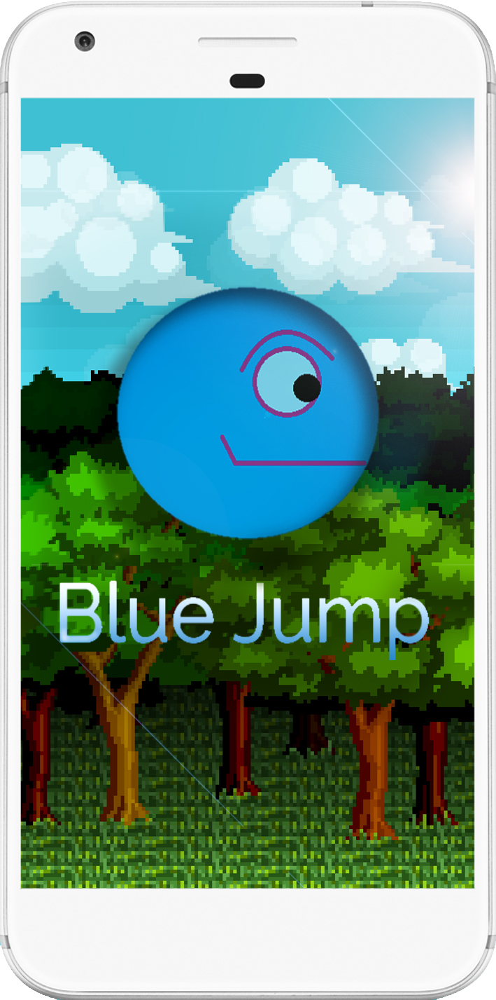

# BlueJump
<div align="center">
A 2D side-scrolling endless runner Android game created using LibGDX Framework.
</div>
<br> <div align="center">


</div>

## Installation

Clone this repository and import into **Android Studio**

```bash
git clone https://github.com/eliajada/BlueJump.git
```

## Requirements

* [Android SDK](http://developer.android.com/sdk/index.html)
* Android 5.0+ platform

## Generating APK

1. **Build** menu
2. **Build Bundle(s) / APK(s)** menu
3. **Build APK(s)**
